# Causal Inference for Conflict with Machine Learning

## Research Question

Does UN peacekeeping deployment reduce violence against civilians in Africa, and does this effect vary across different conflict contexts?

## Navigation

| Section | Description |
|---------|-------------|
| [Motivation](#motivation) | Why causal inference matters for conflict research |
| [Key Findings](#key-findings) | Main results across all methods |
| [Data](#data-sources) | Five merged data sources covering 43 African countries |
| [Methods](#methods) | OLS, Double Machine Learning, Causal Forests |
| [Results in Detail](#results-in-detail) | Figures and interpretation for each analytical step |
| [Robustness](#robustness) | Five alternative specifications and placebo test |
| [Notebooks](#notebooks) | Four-notebook analytical progression |
| [How to Reproduce](#how-to-reproduce) | Setup and replication instructions |
| [References](#key-references) | Academic sources |

## Motivation

Prediction models show what correlates with violence, but they cannot answer whether an intervention *causes* a change in outcomes. This project applies causal machine learning methods to estimate the effect of UN peacekeeping on civilian violence using observational panel data from 43 African countries (2000–2022).

## Key Findings

**Selection bias is severe.** A naive comparison shows peacekeeping countries have 2.90 *more* one-sided violence events per month, because the UN sends missions to the most violent places, not because peacekeeping causes violence.

**OLS underestimates the protective effect.** After linear controls, OLS still estimates +0.49 events/month. Linear models cannot fully capture the nonlinear confounding.

**Double Machine Learning flips the sign.** After flexible ML-based confounder control, the estimated average treatment effect is −0.16 events/month (95% CI includes zero, p = 0.82). The average effect is not statistically significant.

**Heterogeneity reveals where peacekeeping works.** Causal Forests show that 8 of 12 peacekeeping countries have negative treatment effects. The strongest protective effects appear in low-income countries (CATE = −0.60), highly fractionalized countries (CATE = −0.57), medium-intensity conflicts (CATE = −0.57), and country-months following high prior violence (CATE = −0.59).

**Results are robust.** All five DML specifications (different ML models, lagged treatment, deaths outcome, PK-countries-only subsample) produce negative ATEs. Placebo test passed.

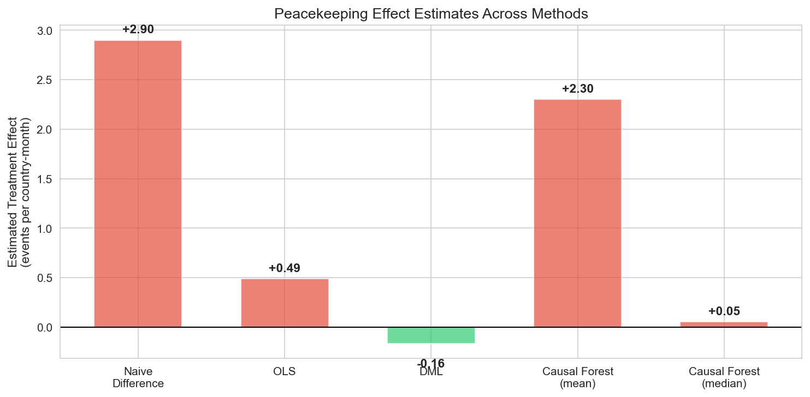

## Data Sources

| Dataset | Source | Role |
|---------|--------|------|
| UCDP GED v25.1 | Uppsala University | Outcome: one-sided violence events and fatalities |
| UN DPKO mission records | UN Department of Peace Operations | Treatment: peacekeeping mission presence (12 missions) |
| World Bank WDI | World Bank API | Confounders: GDP per capita, population |
| Alesina et al. (2003) | Published fractionalization indices | Confounder: ethnic fractionalization |
| UCDP GED (derived) | Uppsala University | Confounder: active armed conflict, battle intensity |

**Panel dimensions:** 11,825 country-months (43 countries, Feb 2000 to Dec 2022). 1,726 treated (14.6%).

## Methods

- **OLS Regression**: Baseline estimate of the average treatment effect with linear confounder control
- **Double Machine Learning (DML)**: Uses gradient boosting to flexibly control for high-dimensional confounders while preserving valid causal inference (Chernozhukov et al., 2018)
- **Causal Forests**: Estimates heterogeneous treatment effects, revealing where and for whom peacekeeping works best (Athey and Wager, 2018)
- **SHAP Analysis**: Identifies which country characteristics drive treatment effect heterogeneity

## Results in Detail

### Treatment: UN Peacekeeping Missions in Africa

Twelve African countries had UN peacekeeping missions during the study period. Several missions start and end within the panel, providing temporal variation for causal identification.

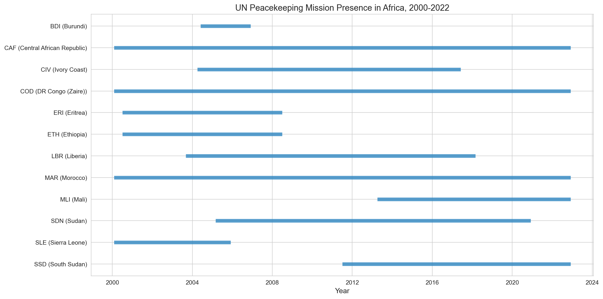

### Outcome: One-Sided Violence Against Civilians

78.5% of country-months have zero one-sided violence events. Violence is concentrated in a small number of countries, with the DRC accounting for roughly 27% of all events.

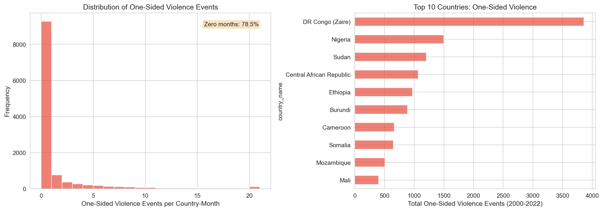

### Violence and Peacekeeping Over Time

Violence trends upward from 2012 onward. Peacekeeping presence fluctuates between 4 and 9 countries but does not track the violence trend closely, which helps with identification.

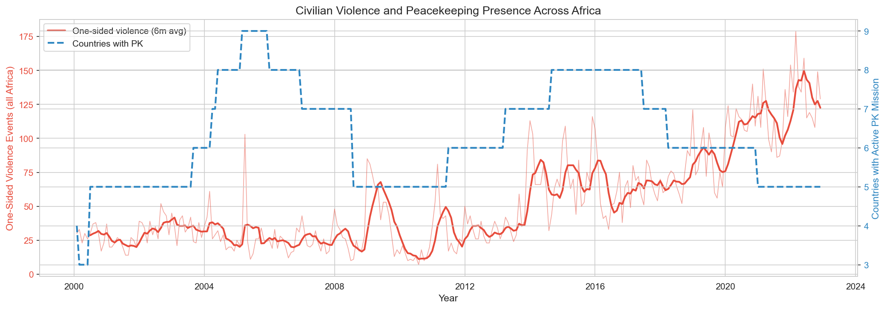

### Selection Bias: The Core Problem

Every confounder shows meaningful imbalance (SMD > 0.25) between treated and untreated country-months. Peacekeeping countries are poorer, larger, more ethnically fractionalized, and have more active conflict.

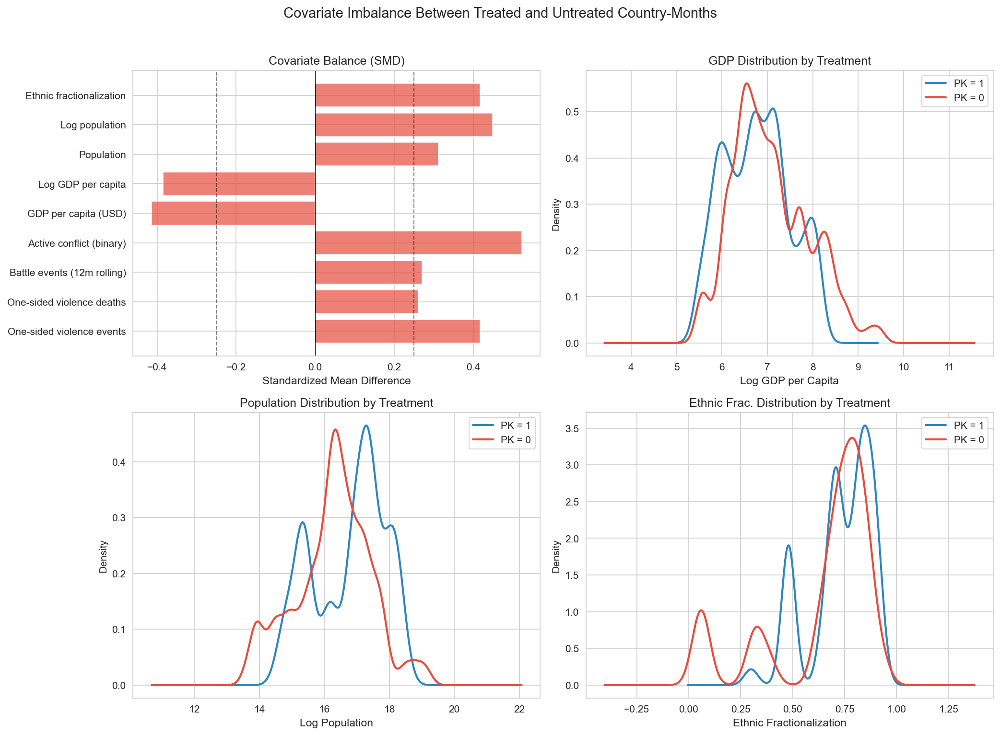

The naive comparison shows +2.90 more events per month with peacekeeping. This positive difference is selection bias, not a causal effect.

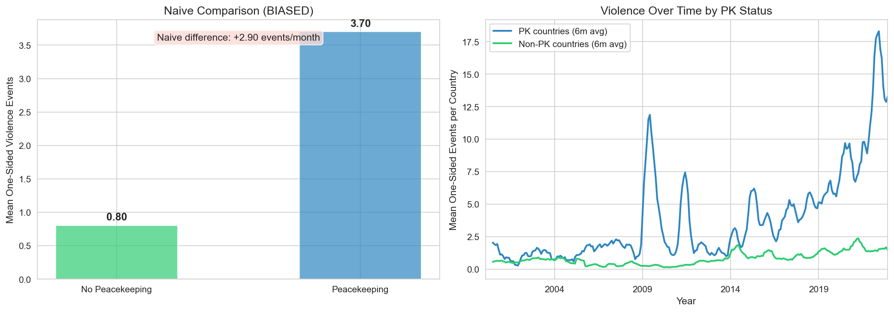

### Confounder Structure

The correlation heatmap shows which variables are associated with both treatment and outcome. Lagged violence (r = 0.81 with outcome, r = 0.22 with treatment) and active conflict are the strongest confounders.

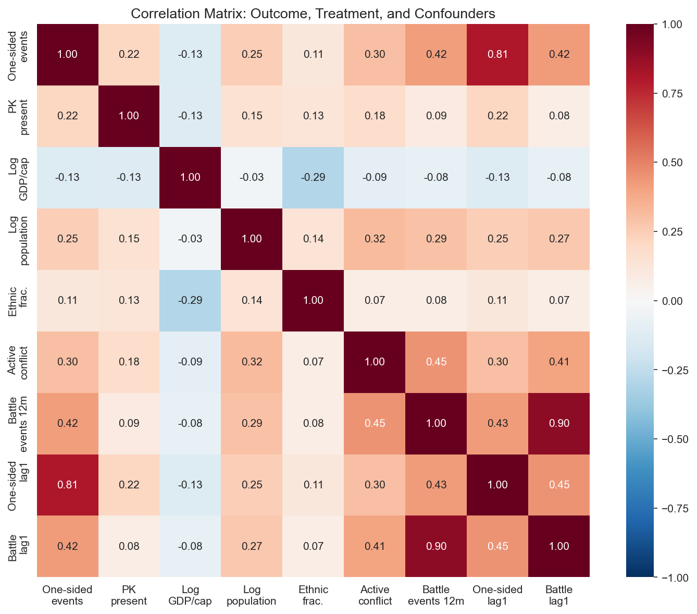

### Causal Estimates Across Methods

OLS reduces the naive bias from +2.90 to +0.49 but does not eliminate it. DML flips the sign to −0.16. The Causal Forest mean (+2.30) is pulled by extreme outliers while the median sits near zero (+0.05).


### Heterogeneous Treatment Effects

Eight of twelve peacekeeping countries show negative CATEs (peacekeeping reduces violence). Mali shows the strongest effect (−1.35), followed by CAR (−0.90) and Eritrea (−0.76).

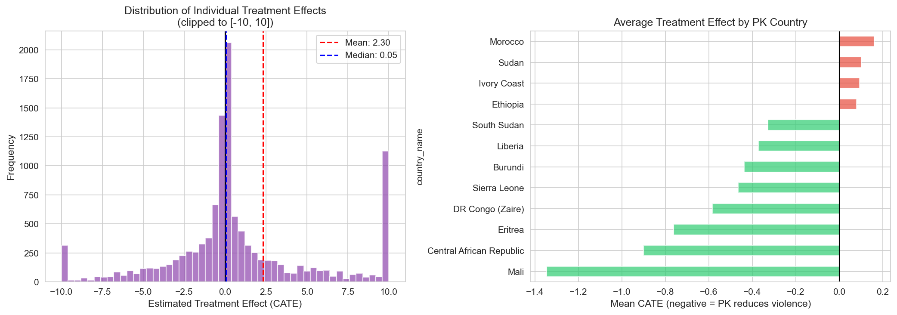

### What Drives Peacekeeping Effectiveness (SHAP)

GDP per capita is the strongest driver of treatment effect heterogeneity, followed by population size and ethnic fractionalization.

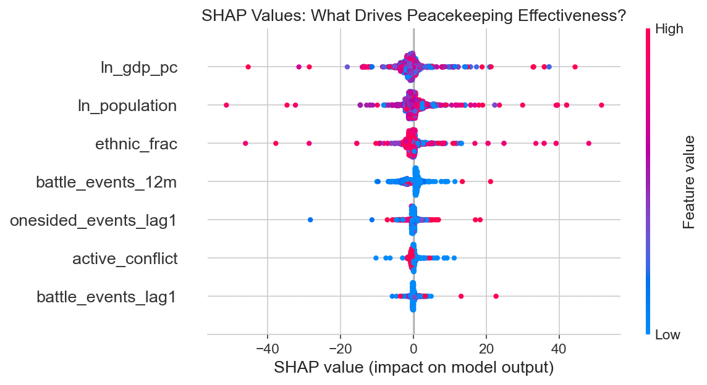

### Subgroup Analysis

Peacekeeping works best in low-income countries (−0.60), highly fractionalized settings (−0.57), medium-intensity conflicts (−0.57), and months following high prior violence (−0.59).

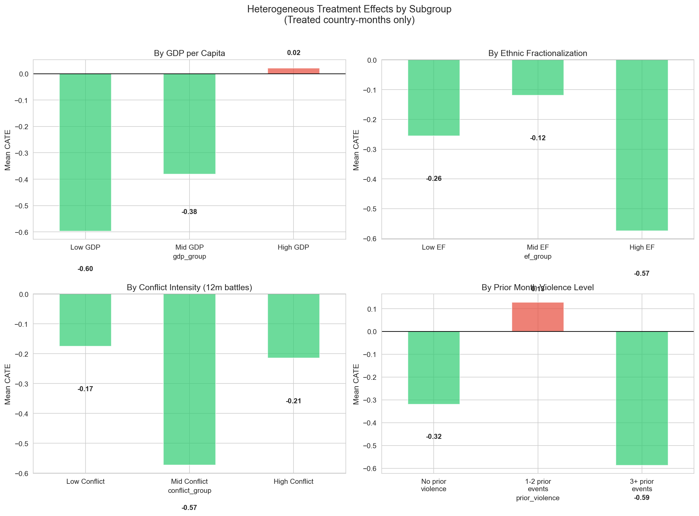

## Robustness

All five DML specifications produce negative ATEs. The placebo test (shuffled treatment) returns an ATE near zero (−0.04), confirming the estimation procedure does not generate spurious effects.

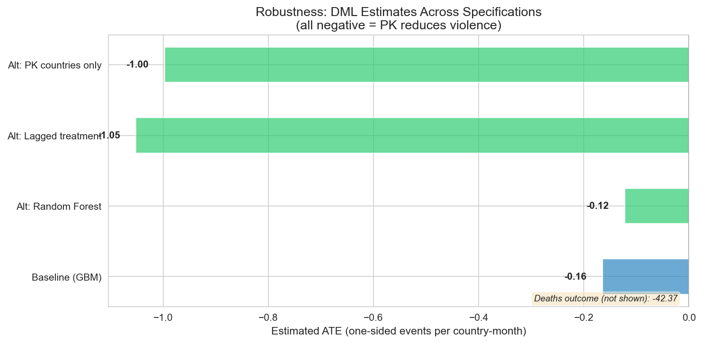

| Specification | ATE | Direction |
|---------------|-----|-----------|
| Baseline (Gradient Boosting) | −0.16 | PK reduces violence |
| Random Forest first stage | −0.12 | PK reduces violence |
| Lagged treatment (t−1) | −1.05 | PK reduces violence |
| Deaths as outcome | −42.37 | PK reduces violence |
| PK countries only | −1.00 | PK reduces violence |
| Placebo (shuffled treatment) | −0.04 | Near zero (as expected) |

## Project Structure

```
conflict-causal-inference/
├── data/
│   ├── raw/              # Original downloaded files (not tracked)
│   └── processed/        # Cleaned, merged panel (not tracked)
├── notebooks/
│   ├── 01_data_assembly.ipynb
│   ├── 02_exploratory_analysis.ipynb
│   ├── 03_causal_estimation.ipynb
│   └── 04_heterogeneity_robustness.ipynb
├── docs/                 # Explanatory guides for each notebook
├── figures/              # Saved plots
├── requirements.txt
└── README.md
```

## Notebooks

| Notebook | Description | Key Output |
|----------|-------------|------------|
| 01 Data Assembly | Merge five data sources into an 11,825-row country-month panel | `panel_country_month.csv` |
| 02 Exploratory Analysis | Treatment/outcome distributions, covariate balance, selection bias | All SMD > 0.25, naive diff = +2.90 |
| 03 Causal Estimation | OLS, Double ML, Causal Forests | ATE: OLS +0.49, DML −0.16 |
| 04 Heterogeneity and Robustness | Subgroup CATEs, SHAP, robustness, placebo | 8/12 countries negative CATE |

## How to Reproduce

1. Download UCDP GED v25.1 from https://ucdp.uu.se/downloads/ and place in `data/raw/`
2. Install dependencies: `pip install -r requirements.txt`
3. Run notebooks in order: 01, 02, 03, 04

Notebook 01 downloads World Bank data via the `wbgapi` API (requires internet connection). Peacekeeping mission dates and ethnic fractionalization values are coded directly in the notebooks.

## Key References

- Chernozhukov, V. et al. (2018). Double/Debiased ML for Treatment and Structural Parameters. *Econometrics Journal*.
- Athey, S. and Wager, S. (2018). Estimation and Inference of Heterogeneous Treatment Effects using Random Forests. *JASA*.
- Hultman, L., Kathman, J., and Shannon, M. (2013). United Nations Peacekeeping and Civilian Protection in Civil War. *AJPS*.
- Wager, S. (2025). *Causal Inference: A Statistical Learning Approach*. Stanford.
- PyWhy: [EconML](https://github.com/py-why/EconML) and [DoWhy](https://github.com/py-why/dowhy)

## Skills Demonstrated

Causal identification with observational data, Double Machine Learning, Causal Forests for heterogeneous treatment effects, multi-source panel data assembly, SHAP interpretation of causal models, robustness and sensitivity analysis, integration of causal reasoning with conflict theory.

## Portfolio Context

| Project | Topic | Status |
|---------|-------|--------|
| 1 | [Conflict Event Data Analysis and Geospatial Visualization](https://github.com/Sezibra/conflict-event-analysis) | Complete |
| 2 | [LLM-Powered Conflict Text Analysis](https://github.com/Sezibra/conflict-text-analysis) | Complete |
| 3 | [Conflict Actor Network Analysis](https://github.com/Sezibra/conflict-network-analysis) | Complete |
| 4 | [Conflict Forecasting with Machine Learning](https://github.com/Sezibra/conflict-forecasting-ml) | Complete |
| 5 | **Causal Inference for Conflict with ML** (this repo) | **Complete** |
| 6 | [Satellite Imagery for Conflict Damage Assessment](https://github.com/Sezibra/conflict-satellite-damage) | Complete |
| 7 | [Agent-Based Modeling for Conflict Dynamics](https://github.com/Sezibra/conflict-abm-simulation) | Complete |
| 8 | [Digital Trace Data Collection](https://github.com/Sezibra/conflict-data-collection) | Complete |
